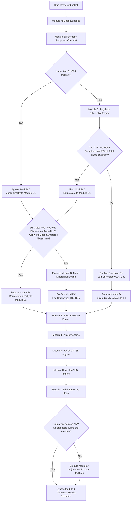

Here is the master architectural document designed specifically for your AI agent to handle the cross-module routing and jump-logic execution between **Modules A, B, C, D, E, and J**.

This document serves as the global router logic for your backend programming.

---

# SCID-5-CV Master Cross-Module Routing Documentation

## 1. Architectural Overview

The SCID-5-CV is not a simple linear questionnaire; it behaves as an interconnected state machine. The agent must evaluate the clinical state at the end of specific modules to determine if a patient qualifies for a primary diagnosis, a secondary diagnosis, or if entire sections must be bypassed to save runtime energy and preserve diagnostic validity.

---

## 2. Global Module Sequencer (The Main Router)

The engine must execute or bypass modules based on this exact hardcoded sequence:

$$\text{Module A} \longrightarrow \text{Module B} \longrightarrow \text{Module C} \longrightarrow \text{Module D} \longrightarrow \text{Module E} \longrightarrow \text{Module F} \longrightarrow \text{Module G} \longrightarrow \text{Module H} \longrightarrow \text{Module I} \longrightarrow \text{Module J}$$

---

## 3. Critical Routing Logic Between Modules C & D

### Case 1: Bypassing Module C Entirely

* **Trigger Condition**: When the agent finishes **Module B** (Psychotic Symptoms Checklist), it must count the total number of positive flags across all 24 items ($B1$ through $B24$).

* **Router Logic**:

$$\text{If } \sum(B1 \dots B24) == 0$$

* **Action**: **Bypass Module C completely.** The agent must skip pages 37 to 44 and jump the state directly to **Module D1** (Differential Diagnosis of Mood Disorders, page 45).

* **Why?**: If no psychotic features are present, evaluating Schizophrenia or Schizoaffective criteria introduces logical noise and disrupts the conversation.

### Case 2: The Core Conflict Resolution (The 50% Rule in C3 & C11)

When Module C is active, the agent faces the hardest architectural decision: separating **Schizoaffective Disorder** from a **Mood Disorder with Psychotic Features**.

* **The 50% Threshold Check ($C3$ & $C11$)**:
* The agent evaluates the lifetime duration of *Active Phase Psychotic Symptoms* vs. *Major Mood Episodes (Manic/Depressive)*.

* **Condition A (Mood Symptoms are the Minority $< 50\%$ of total illness duration)**:
* **Action**: Route the state downward within **Module C** to confirm a primary psychotic disorder (Schizophrenia or Schizoaffective Disorder).

* **Termination Outcome**: Once the exact psychotic disorder is chronologically logged ($C25$ through $C30$), the router issues a mandatory command: **Bypass Module D completely and jump straight to Module E (Substance Use, page 53)**.

* **Condition B (Mood Symptoms are the Majority $\ge 50\%$ of total illness duration)**:
* **Action**: The psychotic disorder criteria fail the dominance rule.

* **Router Command**: Abort Module C processing at $C3$ or $C11$. The agent must register a "Psychotic Mood Presentation" flag and **immediately exit Module C to enter Module D1**.

### Case 3: The Pre-Condition Gate for Module D ($D1$)

* **Trigger Condition**: Upon hitting state $D1$, the system checks the active flags.

* **Router Logic**:

$$\text{If (No Mood Symptoms ever flagged in Module A) OR (A Psychotic Disorder was already confirmed in Module C)}$$

* **Action**: **Bypass Module D entirely.** Route the current execution thread directly to **Module E1** (Alcohol Use Disorder, page 53).

---

## 4. Summary Table of Inter-Module Jump Points

Use this lookup table to map your conditional statements in Django/Python:

| Current State / Module End | Condition to Evaluate | Target Destination (Jump Point) | Operational Goal |
| --- | --- | --- | --- |
| **End of Module B**  | All psychotic items ($B1 \dots B24$) are False.

 | **Module D1** (Mood Differential, p. 45).

 | Skips unneeded psychotic evaluation.

 |
| **Module C3 / C11**  | Mood symptoms make up $\ge 50\%$ of the psychotic illness duration.

 | **Module D1** (Mood Differential, p. 45).

 | Redirects to evaluate a primary Mood Disorder with Psychotic Features.

 |
| **Module C Chronology Completed** ($C25 \dots C30$)

 | A primary Psychotic Disorder (e.g., Schizophrenia) is officially confirmed.

 | **Module E1** (Substance Use, p. 53).

 | Bypasses Module D since mood symptoms are already ruled secondary to psychosis.

 |
| **Module D1**  | Principal psychotic disorder confirmed in C OR no clinically significant mood signs ever registered in Module A.

 | **Module E1** (Substance Use, p. 53).

 | Completely skips Module D.

 |
| **Module D Chronology Completed** ($D17 \dots D25$)

 | Any primary Mood Disorder (Bipolar I/II, MDD) is officially confirmed.

 | **Module E1** (Substance Use, p. 53).

 | Clean transition into substance evaluation.

 |
| **Module I Screening Ended**  | Patient met criteria for *any* principal DSM-5 diagnosis anywhere earlier in the interview.

 | **TERMINATE INTERVIEW** (Bypass Module J).

 | Concludes the interview booklet.

 |
| **Module I Screening Ended**  | Patient did *not* meet criteria for any diagnosis anywhere in the booklet.

 | **Module J1** (Adjustment Disorder, p. 94).

 | Evaluates for Adjustment Disorder as a fallback diagnosis.

 |

---

## 5. Global Routing State Machine (Mermaid Diagram)

---

### Implementation Tip for your Python/Django Agent:

1. Initialize a `session_state` context dictionary at runtime containing variables like: `has_psychotic_symptoms: boolean`, `mood_duration_percentage: integer`, and `confirmed_diagnoses: list`.
2. Before rendering or executing a diagnostic node block, the agent must check this global `session_state` matrix against the rules documented above to instantly calculate the next question path.

This completes your master routing map. If you are ready, we can move forward with standardizing any validation loops for the agent!